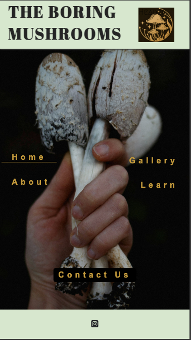
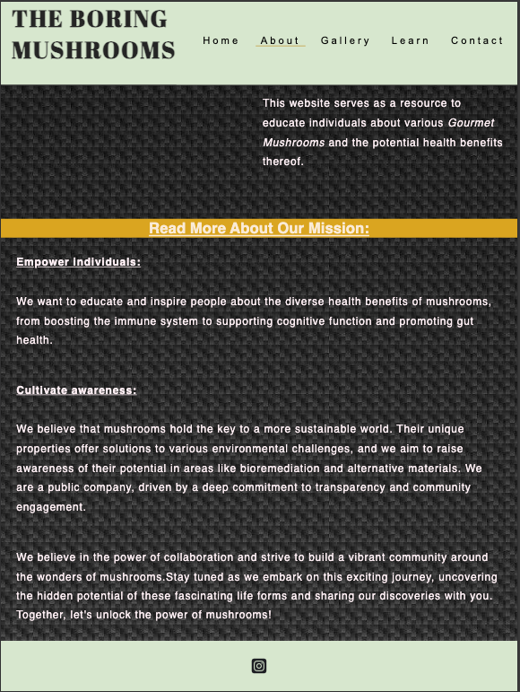

# Purpose

A BORING MUSHROOM WEBSITE is a user-friendly, responsive website that showcases a variety of Gourmet mushrooms, ensuring optimal viewing experience across an array of devices.

- **Problem Statement:** People interested in mushrooms often lack easily accessible, visually-appealing resources to learn about diverse gourmet mushrooms.

- **Solution:** This website provides an engaging platform that offers images and informative details on popular gourmet mushroom varieties.

- **Key Objectives:**

   * **Efficiency:** Clear navigation and well-organized information promote easy knowledge discovery.
   * **Discovery:** Enticing images and interesting details encourage users to explore and learn about new mushroom varieties.

# UX Design

Our website presents a simple, user-friendly interface for discovering 16 gourmet mushroom varieties and their intriguing facts.  Here's what we offer:

- **Diverse Showcase:** Discover a collection of popular gourmet mushrooms, each presented with beautiful image and insightful descriptions.
- **Intriguing Details:** Learn about the origins, culinary uses, and potential health benefits of these delicious fungi.
- **Community Engagement:** Share your passion for mushrooms! Provide feedback and help us improve our website or simply get in touch with us to say 'hi'.
- **Continuous Growth:** We're committed to regularly updating the website with the latest information and new gourmet mushroom discoveries.

# Features

## Functions and features Overview
Our website comprises five easily navigable pages. Here's a breakdown:

- **`Home page`**
    * **Purpose:** On the Home page, the user is welcomed with a clean user interface of the website where only the absoulte essential links are kept. The 'Home Page' is created differently than rest of the page to give a minimilistic look. This page leads the user to different webpages of the website.
    * **Functionality:** Features the website logo, company name, and five hyperlinks for seamless navigation. Active pages are indicated with an underline and hover effects.
    * **Deployed website:** Images of the deployed Home page for two screen sizes:
        * **Screen size 375x667px (iPhone SE):**
            
        * **Screen size 768x1024px (iPad Mini):**
            

- **`About`**
    * **Purpose:** The About page has the company name on the top left corner of the screen followed by a navigation bar that is only active until the user is accessing the website via a device with min-width less then 768px. Tells the story behind the website, its creators, and their motivations. 
    * **Functionality:** Features a navigation bar active on smaller screens (less than 768px width). Offers a hidden "Read more about our mission" section revealed on click, with a hover effect.
    * **Deployed website:** Images of the deployed About page for two screen sizes:
        * **Screen size 375x667px (iPhone SE):**
            
            
        * **Screen size 768x1024px (iPad Mini):**
            
            

- **`Gallery`** 
    * **Purpose:** Showcases images of all featured gourmet mushrooms, providing links to their details on the 'Learn' page.
    * **Functionality:** Maintains a clean, image-focused design. Image captions link to corresponding sections on the 'Learn' page.
    * **Deployed website:** Images of the deployed Gallery page for two screen sizes:
        * **Screen size 375x667px (iPhone SE):**
            
        * **Screen size 768x1024px (iPad Mini):**
            

- **`Learn`**
    * **Purpose:** Provides interesting facts and stories about different mushrooms on the website.
    * **Functionality:** Every section is further linked to its corresponding picture in the gallery.html page.  
    * **Deployed website:** Images of the deployed Home page for two screen sizes:
        * **Screen size 375x667px (iPhone SE):**
            
            
        * **Screen size 768x1024px (iPad Mini):**
            

- **`Contact Us`**
    * **Purpose:** Enables users to send feedback and choose their favorite mushrooms from a questionnaire.
    * **Functionality:** Features fields for simple contact details, mushroom preferences and leave feedback.
    * **Deployed website:** Images of the deployed Home page for two screen sizes:
        * **Screen size 375x667px (iPhone SE):**
            
        * **Screen size 768x1024px (iPad Mini):**
            

## Possible Future Implementations
The website has the potential to expand into a commercial platform with features like ordering, user feedback, and reviews.

## Accessibility
I prioritized accessibility with mindful code practices, semantic tags, descriptive alt attributes for images, and clear indication of the active page throughout navigation.

## Recommended screen sizes and devices
The website works perfectly well with the following screen sizes and the corresponding devices:

- iphone SE , screen size: 375 x 667px
- ipad mini, screen size: 768 x 1024px
- ipad air, screen size: 820 x 1180px
- ipad pro, screen size: 1024 x 1366px

# Technologies

## Languages

- HTML
- CSS

## Program, frameworks , libraries and tools

- [Gitpod](https://gitpod.io/) IDE to develop the website.
- [GitHub](https://GitHub.com/) to host the source code.
- [GitHub Pages](https://pages.github.com/) to deploy and host the live website.
- Git to provide version control (to commit and push code to the repository). 
- [W3C HTML Validator](https://validator.w3.org/#validate_by_input) to validate HTML code.
- [W3C CSS Validator (Jigsaw)](https://jigsaw.w3.org/css-validator/#validate_by_input) to validate HTML code.
- Code Institute's Python Template to generate the workspace for the project.

# Deployment

## Github and Github pages
This project was created on GitHub using the Code Institute template and deployed live using GitHub Pages. The instructions to achieve this are below:

1. Log in (or sign up) to Github.
2. Find the repository for this project, mushroom_stories.
3. Click on the Settings link.
4. Click on the Pages link in the left hand side navigation bar.
5. In the Source section, choose main from the drop down select branch menu. Select Root from the drop down select folder menu.
6. Click Save. Your live Github Pages site is now deployed at the URL shown. 

## Version control
Git was used for version control. Changes were committed to the main branch of the GitHub repository. 
The following commands were used throughout the project:

git add . - new (or untracked), deleted and modified files are added to Git staging area.
git commit -m "commit message" - to commit changes to the local repository.
git push - to push all committed changes to the GitHub repository.
git pull - to pull the changes from the remote branch and integrate them with the current local branch.
git status - to display the state of the working directory and the staging area.
git log - to display commits.

## How to Fork
To fork the mushroom_stories repository:

1. Log in (or sign up) to Github.
2. Go to the repository for this project, hsjoi0214/mushroom_stories.
3. Click the Fork button in the top right corner.

## How to Clone
To clone the mushroom_stories repository:

1. Log in (or sign up) to GitHub.
2. Go to the repository for this project, hsjoi0214/mushroom_stories.
3. Click on the code button, select whether you would like to clone with HTTPS, SSH or GitHub CLI and copy the link shown.
4. Open the terminal in your code editor and change the current working directory to the location you want to use for the cloned directory.
5. Type 'git clone' into the terminal and then paste the link you copied in step 3. Press enter.

# Testing

Testing was done both at my local machine level and when the program was deployed on GitHub Pages.

## Testing done Locally

### Debugging scenario 1: 

- **Expected behaviour:** 

- **Result:** 

    

- **Fix:** 

    

- **Result after the fix:** 

    

### Debugging scenario 2: 

- **Expected behaviour:** 

- **Result:** 

    

- **Fix:** 

- **Result after the fix:** 

    

### Debugging scenario 3: 

- **Expected behaviour:** 

- **Result:** 

- **Fix:** 

    

- **Result after the fix:** 

### Debugging scenario 4: 

- **Expected behaviour:** 

- **Result:** 

    

- **Fix:** 

    

- **Result after the fix:** 

    

## Testing when deploying on GitHub pages

# Credits

## Media
Images used in this project:

- Shitake: Photo by Vadym Alyekseyenko: https://www.pexels.com/photo/mushrooms-in-close-up-photography-10923305/
- Oyster: by Frank Hyman PHOTO: Jolanda Aalbers/Shutterstock
- Poaching: https://goodcexet.life/product_details/58849361.html
- Portobello: https://www.shroomer.com/portobello-mushrooms/
- Chanterelle : https://www.foragesf.com/blog/2019/10/25/how-to-safely-identify-tasty-wild-chanterelle-mushrooms
- Coral: https://www.coastalrivers.org/coral-mushrooms/
- Enoki: https://foragerchef.com/fish-sauce-pickled-enoki/
- Hedgehog: https://www.tastingtable.com/1128107/what-makes-hedgehog-mushrooms-unique/   by Claire redden
- Black trumpet: https://www.mushroomstalkers.com/blog/how-to-find-mushrooms/where-can-you-find-black-trumpets/
- Morel: Photo by Beth Macdonald on Unsplash
- Button: https://freakofnatural.com/what-mushroom-species-to-grow/
- Turkey-tail: Image by Ian Lindsay from Pixabay
- Lions mane: Photo By Lebrac / Wikimedia Commons
- Maiitake: Getty Images/ueapun
- Trail16:Photo by Ashish Raj on Unsplash
- Trail02: Photo by Irina Iacob on Unsplash

## HTML and CSS related sources
- HTML Box-shadow: https://developer.mozilla.org/en-US/docs/Web/CSS/box-shadow
- Learn CSS: https://developer.mozilla.org/en-US/docs/Learn/CSS
- Learn HTML: https://developer.mozilla.org/en-US/docs/Learn/HTML
- Code institute for providing template and know-how to work with Github,Gitpod and Github Pages.

# Acknowledgements

Special thanks to my mentor ' Mr. Ronan McClelland' for providing me with various materials and his valuable pointers during the submission phase.